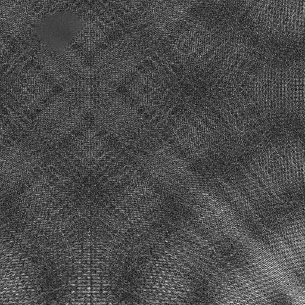
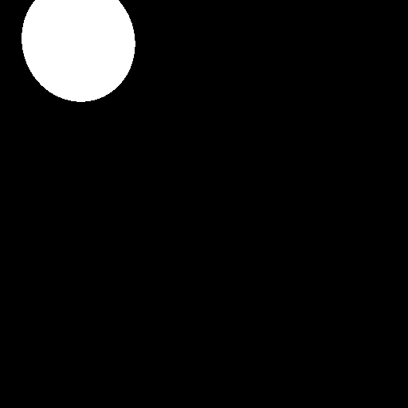
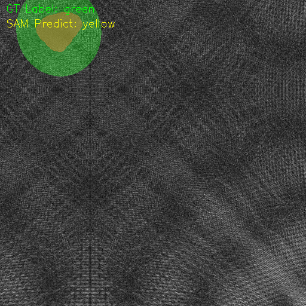
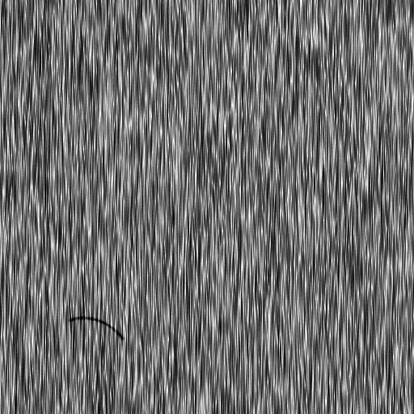
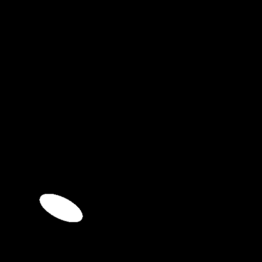
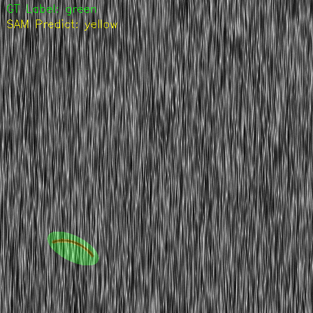
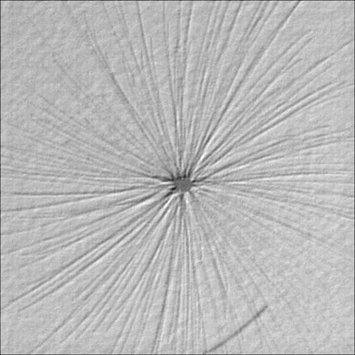
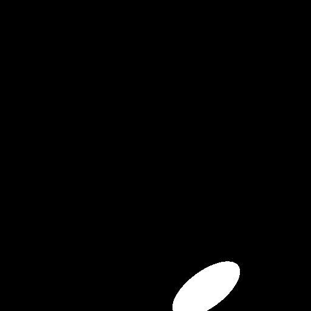
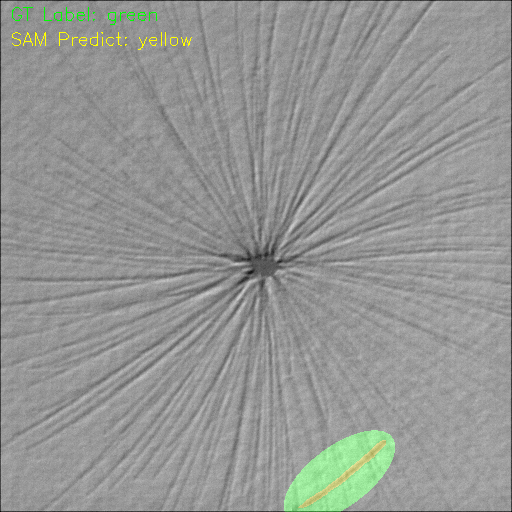

# Chip Defect Detection - Auto Labeling Toolkit

A modular pipeline for automatic annotation of chip defect datasets using Grounding DINO, SAM, and YOLOv8 segmentation format. Built for scalable, high-quality dataset creation in industrial AI applications.

## 🧠 Project Overview

1. **Object Detection (Grounding DINO)**  
   Localizes defect regions using text prompts.

2. **Segmentation (SAM)**  
   Generates fine-grained masks based on detected bounding boxes.

3. **Label Conversion (YOLOv8 format)**  
   Converts segmentation masks into YOLOv8-style segmentation labels.

4. **Automatic Annotation Pipeline**  
   End-to-end workflow for generating labeled datasets with minimal manual effort.

5. **Mask Validation & Visualization**  
   Supports IoU-based evaluation and overlay visualization with ground truth.

6. **Modular & Extensible**  
   Each module (detection, segmentation, conversion, validation) is independently reusable and replaceable.

7. **Use Cases**  
   - Industrial defect detection (e.g., chip surface inspection)  
   - Dataset generation for segmentation model training  
   - Model result inspection and annotation refinement

## 📸 Demo Preview

Below is an example of the annotation pipeline result:

| Original Image | True Mask | Prediction Result |
|----------------|-------------------------|-------------|
|  |  |  |
|  |  |  |
|  |  |  |

> 📝 Images above illustrate the transition from raw image → bounding box → mask → YOLO format.

## 📂 Folder Structure

```
SmartLabeler/
├── main.py                         # Pipeline entry point
├── README.md
├── requirements.txt
├── Dockerfile                      # Optional: for containerized deployment
├── inference/                      # Inference modules (GroundingDINO / SAM / YOLO)
│   ├── coco_utils.py
│   ├── grounding_utils.py
│   ├── sam_utils.py
│   └── yolo_utils.py
├── models/                         # Pretrained weights
│   ├── sam_vit_h_4b8939.pth
│   └── GroundingDINO/
│       └── groundingdino_swinT_ogc.pth
├── test_data/                      # Example images for testing
│   ├── class1/
│   │   ├── 0593.PNG ...
│   │   ├── true_masks/
│   │   ├── outputs/                    # Output results(yolo format) and manual_check_list
│   │   └── validation_vis_sam/         # Visualization of ground truth vs predicted mask overlay
│   ├── class2/
│   ├── class3/
├── utils/                          # Utility scripts
│   ├── common.py
│   ├── visualize.py
│   ├── convert_ClassName2ID.py
│   └── validate/
│       ├── validate_sam_masks.py
│       └── validate_yolo_masks.py
```

## 🚀 Quick Start

```bash
git clone https://github.com/Ching725/SmartLabeler.git
cd SmartLabeler
pip install -r requirements.txt
python main.py

## 📦 Requirements

- Python 3.10+
- PyTorch
- OpenCV
- tqdm
- segment-anything
- GroundingDINO

Install dependencies:
```bash
pip install -r requirements.txt
```

## 🔧 Configuration
Edit `main.py`:
```python
input_dir = "test_data/class*"
output_dir = "test_data/class*/outputs"
main(input_dir, output_dir, prompt="crack", class_name="class2")
```

## 🔃 Clone with Submodules

If you are cloning this repository for the first time, make sure to initialize submodules:

```bash
git clone https://github.com/Ching725/SmartLabeler.git
cd SmartLabeler
git submodule update --init --recursive
```
#### 📦 小補充
你目前的 Git 狀態可以用：

```bash
git submodule status
```

## 📦 Export Format Details（YOLOv8 Label Format）

- Segmentation labels are exported to `.txt` files in YOLOv8 format: class_id x1 y1 x2 y2 x3 y3 … xn yn
- Coordinates are normalized (0~1).
- Each mask is polygon-approximated from binary mask.


## 🧪 Features
- ✅ Automatically detects and segments regions using large vision-language models
- ✅ Converts results to YOLOv8 segmentation labels
- ✅ Filters overly large bounding boxes (reduces false positives)
- ✅ Validates masks by comparing with ground truth (IoU & visual overlay)
- ✅ Modular design for fast adaptation to other models or use cases

## 🧠 Acknowledgements

This project integrates the following models:

- [GroundingDINO](https://github.com/IDEA-Research/GroundingDINO)
- [Segment Anything (SAM)](https://github.com/facebookresearch/segment-anything)
- [YOLOv8](https://github.com/ultralytics/ultralytics)

## 📬 Contact
Feel free to contact me if you'd like to collaborate or suggest improvements!

---
MIT License
